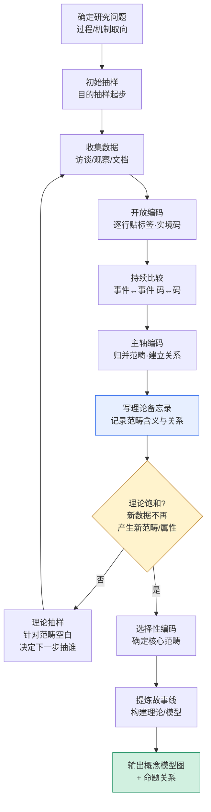
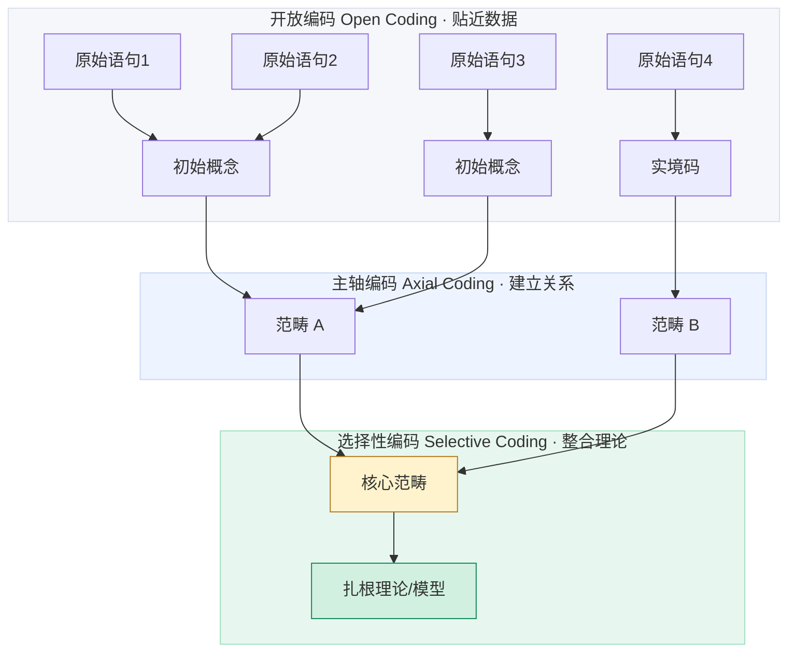
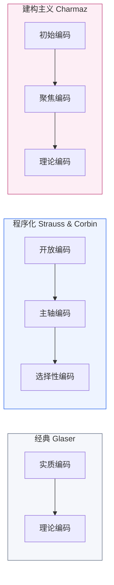
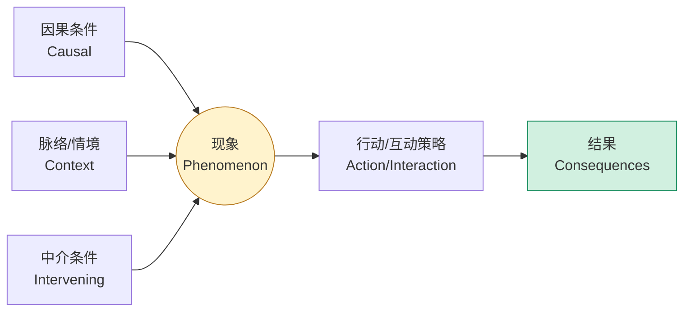
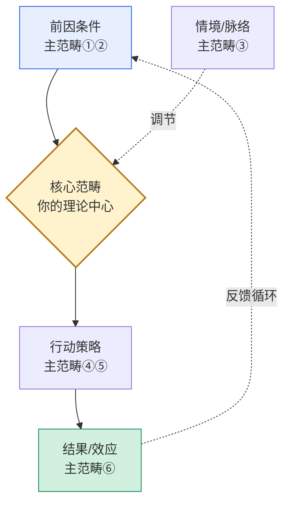

# 扎根理论：编码流程图与模型结构图

> 下列图使用 Mermaid，GitHub 与多数 Markdown 编辑器可直接渲染。需要图片（发小红书/插论文）时，打开同目录 `index.html` 一键查看并截图，或把代码贴到 https://mermaid.live 导出 SVG/PNG。
> 配套方法说明见 [`../references/04-coding-grounded-theory.md`](../references/04-coding-grounded-theory.md)。

## 图 1 · 扎根理论操作循环（含理论抽样与饱和）

这是扎根理论区别于一般编码的核心——**收集与分析交替进行、由浮现的范畴驱动下一轮抽样，直到理论饱和**。

## 图 2 · 三级编码漏斗（数据 → 理论的抽象升级）

## 图 3 · 三流派编码语言对照

标题与正文必须用同一流派，**切忌混用**（详见 04 文档）。

## 图 4 · Strauss & Corbin 编码范式（主轴编码用）

主轴编码把零散范畴围绕一个现象重新组织时的关系骨架。

## 图 5 · 扎根理论模型结构模板（填空即用）

把你的核心范畴与主范畴替换进去，即得论文里的"理论模型图"。

> 提示：模型图不是装饰，箭头要能对应到你数据里支撑的命题（如"前因→核心"对应某条范畴间关系），并在正文逐条论证。
