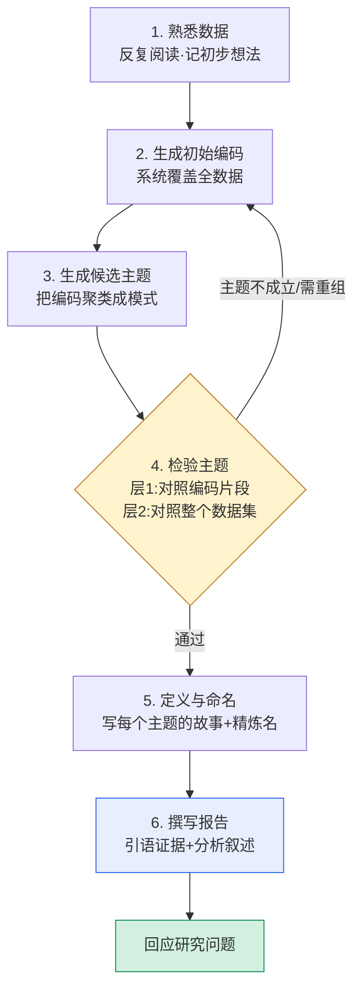
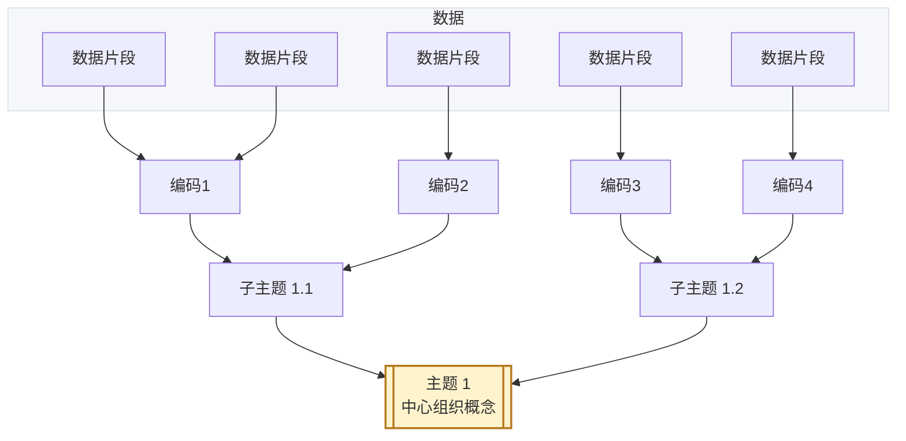
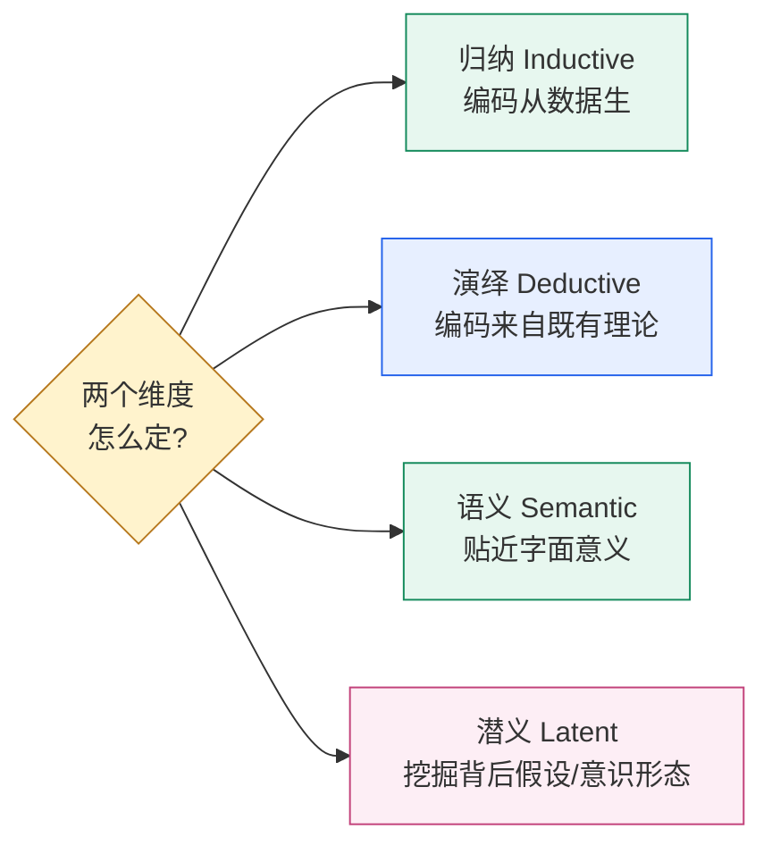
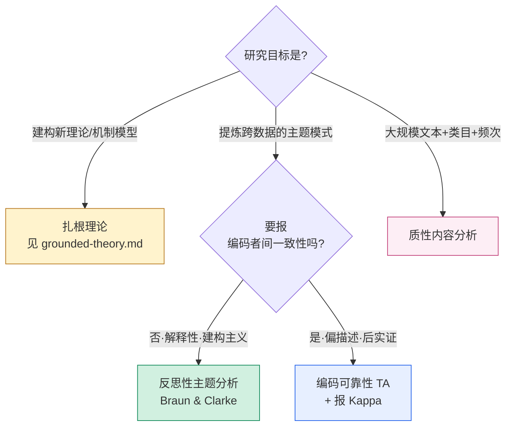

# 主题分析：六步流程图与结构图

> Mermaid 图，GitHub 可直接渲染。需要图片时打开同目录 `index.html` 截图，或贴到 https://mermaid.live 导出。
> 配套方法说明见 [`../references/05-coding-thematic.md`](../references/05-coding-thematic.md)。

## 图 1 · Braun & Clarke 反思性主题分析六步（含迭代回环）

注意：主题分析**不是一条直线**，第 4 步检验主题时常需回到第 2/3 步反复修订。

## 图 2 · 编码 → 主题的层级结构（主题 ≠ 编码汇总）

主题是围绕一个**中心组织概念**的模式，不是"关于某话题的所有说法"的堆叠。

## 图 3 · 主题分析的四种取向（编码前先声明）

## 图 4 · 该用哪种分析？方法决策图

> 关键提醒：反思性主题分析（RTA）的认识论与"编码者间信度/Kappa"有张力——**RTA 路径默认不报 Kappa**。若期刊硬要一致性，走 CRTA 分支并相应调整范式声明（详见 05 与 06 文档）。
